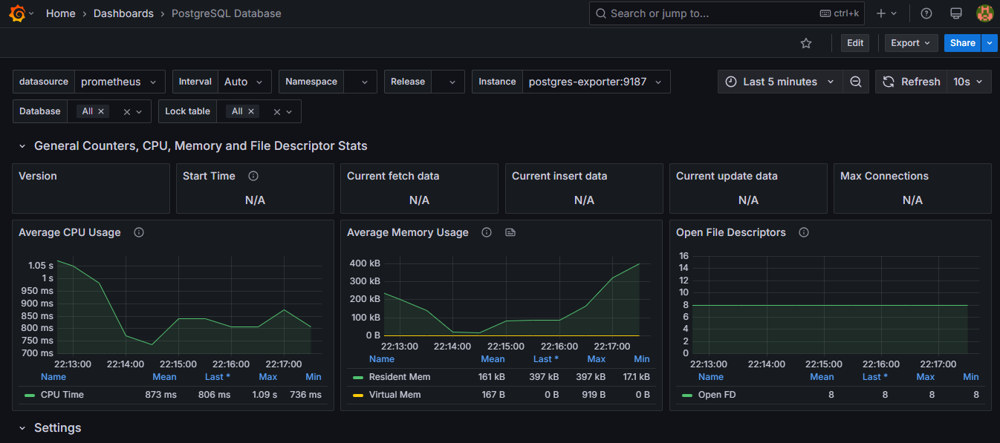

# ObservabilidadeDB

## TF de observabilidade

Configura um docker para visualizar uma dashboard para observar um banco de dados PostgreSQL utilizando: Postgres Exporter, Prometheus e Grafana

### Screenshot da dashboard:



## Para utilizar o serviço

1. Veja se os componentes para utilização de docker estão instalados no ambiente

2. Com o ambiente preparado utilize:
    
```sh

    docker-compose up --build -d
    
```

## Visualizando a dashboard

1. Para ver a dashboard acesse o grafana em `http://localhost:3000`

2. Faça login com:
    -**Usuário** `admin`
    -**Senha** `admin`
    Será solicitado a troca da senha no  primeiro login

3. Clique no menu lateral esquerdo e acesse connections -> data sources -> add data source

4. Escolha "Prometheus" e em Connection insira `http://prometheus:9090` -> Save & test

5. Para visualizar a dashboard clique no menu lateral esquerdo -> Dashboards, clique em new -> import

6. Importe a dashboard inserindo a id 9628 ou faça upload do arquivo no repo em grafana/dashboards/9628_rev8.json; selecione prometheus default como datasource e clique em import

